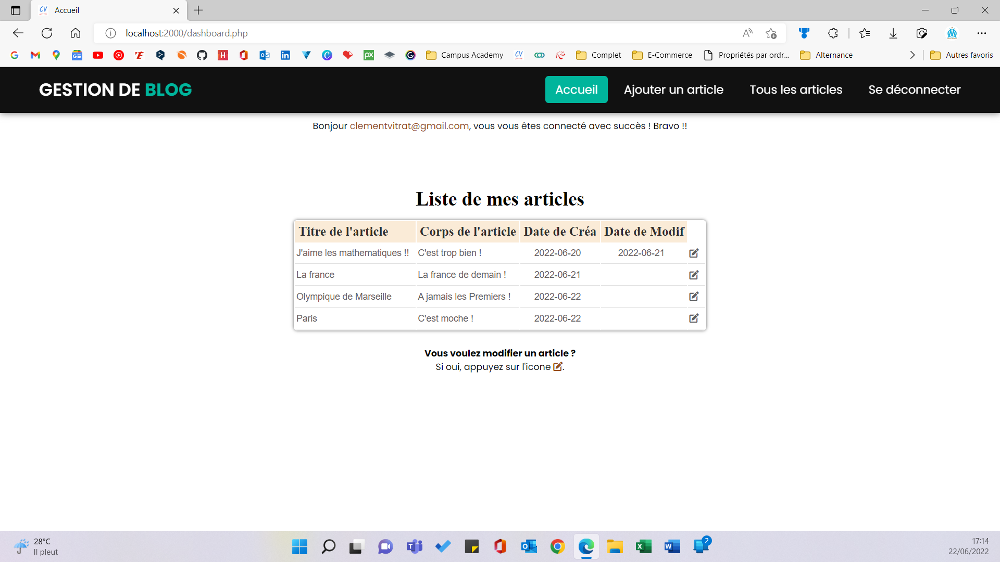
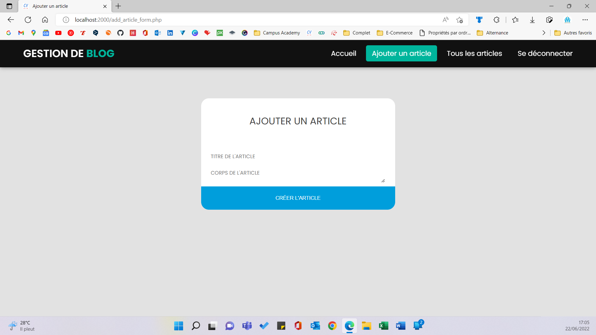

# Exercice - Clément VITRAT - B1 Info Tech

Votre objectif est de réaliser un mini-site de gestion de blog. 
Un utilisateur pourra :

<ul>
    <li>s'enregistrer</li>
    <li>se connecter</li>
    <li>ajouter un article (en étant connecté)</li>
    <li>modifier un article (en étant connecté)</li>
    <li>visualiser sa liste d'article (en étant connecté)</li>
    <li>se déconnecter</li>
    <li>si non connecté, il est possible de voir la liste de tous les articles, avec le nom de leur auteurs.</li>
</ul>

Les articles contiennent :

<ul>
    <li>un titre</li>
    <li>le corps de l'article</li>
    <li>la date de création</li>
    <li>la date de modification</li>
</ul>

Si un utilisateur non connecté essaye d'accéder à une page nécessitant d'être connecté, une redirection vers la page de connexion sera effectuée.

<h3>Consignes :</h3>
<ul>
    <li>Vous enverrez par mail un lien github/gitlab public, contenant l'ensemble de vos fichiers</li>
    <li>Le présent fichier sera à la racine de votre git, nommé <a href="http://README.html">README.md</a>. Vous y décrirez les fonctionnalités réalisées.</li>
    <li>La date de rendu est le 24/05/2022.</li>
</ul>

------------------
<h2>Rattrapage :</h2>

Sur la base du code déjà produit, vous rajouterez les fonctionnalités suivantes :

<ul>
    <li>possibilité pour utilisateur connecté de commenter un article. Sur le commentaire apparaîtra l'email de l'utilisateur et la date du documentaire,</li>
    <li>possibilité pour utilisateur connecté de modifier un commentaire qu'il a fait. Il apparaîtra alors la mention "édité le " et la dernière date de modification,</li>
    <li>possibilité pour utilisateur connecté de voir tous les commentaires qu'il a posé, avec un lien vers les articles associés au commentaire,</li>
    <li>sur la page affichant les articles, afficher les commentaires associés.</li>
</ul>

<h3>Consignes :</h3>
<ul>
    <li>Vous enverrez par mail un lien github/gitlab public, contenant l'ensemble de vos fichiers.</li>
    <li>Le présent fichier sera à la racine de votre git, nommé README.md. Vous y décrirez les fonctionnalités réalisées.</li>
    <li>La date de rendu est le 15/06/2022.</li>
</ul>

-------------------------
-------------------------
-------------------------

## Description des fonctionnalités réalisées :

> ### **Une fois le site lancé :**
> L'utilisateur peut voir les différents articles, s'incrire ou se connecter.
> 
> 
>
> >Une fois le site lancé, l'utilisateur arrive sur une page **index.php** qui est la page d'**ACCUEIL** du site. L'utilisateur peut donc voir la liste des articles (Titre, Corps, Date de création, Date de modification, Auteur) ainsi que les commentaires associés aux différents articles (Texte, Date de création, Date de modification, Auteur).
> >De plus, grâce à la barre de navigation, l'utilisateur peut s'inscrire ou se connecter afin de pouvoir créer à son tour des articles.
> >
> >
> 
> ---
> 
> >Si l'utilisateur souhaite **S'INSCRIRE**, il lui suffit d'appuyer sur **S'inscrire** dans la barre de navigation qui le renverra automatiquement vers la page **register_form.php**.
> >Une fois sur cette page, l'utilisateur devra rentrer les informations suivantes :
> >  - son adresse mail,
> >  - son mot de passe,
> >  - confirmer son mot de passe
> >
> >Puis appuyer sur le bouton **S'inscrire**. Il sera alors rediriger automatiquement vers la page de **Connexion** pour se connecter et pouvoir ainsi ajouter des articles.
> >
> >
>
> ---
>
> >Si l'utilisateur souhaite **SE CONNECTER**, il lui suffit d'appuyer sur **Se connecter** dans la barre de navigation qui le renverra automatiquement vers la page **login_form.php**.
> >Une fois sur cette page, l'utilisateur devra rentrer les informations suivantes :
> >  - son adresse mail,
> >  - son mot de passe
> >
> >Puis appuyer sur le bouton **Se connecter**. Il sera alors rediriger automatiquement vers la page **dashboard.php** contenant tous ses articles s'il en possède déjà. Une fois ici, il pourra modifier un article, créer un article ou se déconnecter.
> >
> >

---

> ### **Une fois l'utilisateur connecté :**
> L'utilisateur peut voir ses différents articles, en ajouter, en modifier, ajouter des commentaires sur des articles, modifier ses commentaires ou se déconnecter.
> 
> 
>
> >L'utilisateur arrive sur la page **ACCUEIL**, **dashboard.php**, où il voit sa liste d'articles s'il en a déjà. De plus, il peut modifier l'article souhaité ou depuis la barre de navigation, ajouter un article, voir tous les articles afin d'ajouter un commentaire ou modifier un de ses commentaire, ou se déconnecter.
> >
> >
> ---
> >Si l'utilisateur souhaite **AJOUTER UN ARTICLE**, il lui suffit d'appuyer sur **Ajouter un article** dans la barre de navigation qui le renverra automatiquement vers la page **add_article_form.php**.
> >Une fois sur cette page, l'utilisateur devra rentrer les informations suivantes :
> > - le Titre de l'article,
> > - le Corps de l'article
> >
> >Puis appuyer sur le bouton **Créer l'article**. Il sera alors rediriger automatiquement vers la page **dashboard.php** contenant tout ses articles. Il pourra ainsi voir dans sa liste d'articles, celui qu'il vient de créer.
> >
> >
>---
> > Si l'utilisateur souhaite **MODIFIER UN ARTICLE**, il lui suffit d'appuyer sur le petit icon avec le stylo en face de l'article qu'il souhaite modifier.
> >
> >
> >
> >Puis il sera renvoyé automatiquement vers la page **modif_article_form.php**.
> >Une fois sur cette page, l'utilisateur pourra modifier les informations suivantes  :
> > - le titre de l'article,
> > - le corps de l'article
> >
> >
> >
> >Puis appuyez sur le bouton, **Modifier l'article**. Il sera alors rediriger automatiquement vers la page **dashboard.php** contenant tout ses articles. Il pourra ainsi voir dans sa liste d'articles, que son article a bien été modifié (grâce à la date de modification).
> ---
> >Si l'utilisateur souhaite **AJOUTER UN COMMENTAIRE**, il lui suffit d'appuyer sur **Tous les articles** dans la barre de navigation qui le renverra automatiquement vers la page **com_articles_affiche.php**.
> >
> >
> >
> > Une fois sur cette page, il choisit l'article auquel il veut ajouter un commentaire. Pour cela, il appuye sur l'icon message se trouvant en face de l'article qu'il veut commenter.
> >
> >Il est alors renvoyé automatiquement vers la page **com_add_articles_form.php**.
> >Une fois sur cette page, l'utilisateur vera le Titre et le Corps de l'article auquel il souhaite ajouter un commentaire, il pourra par la même occasion rentrer l'information suivante :
> > - le texte du commentaire
> >
> > 
> >
> >Puis, appuyez sur le bouton, **Ajouter un commentaire**. Il sera alors rediriger automatiquement vers la page **com_articles_affiche.php** contenant tous les articles et les commentaires associés. Il verra donc que son commentaire a été ajouté.
> ---
> >Si l'utilisateur souhaite **MODIFIER UN COMMENTAIRE**, il lui suffit d'appuyer sur **Tous les articles** dans la barre de navigation qui le renverra automatiquement vers la page **com_articles_affiche.php**.
> >
> >
> >
> >Une fois sur cette page, il lui suffit d'appuyez sur le petit icon avec le style en face du commentaire qu'il souhaite modifier.
> >
> >Il est alors renvoyé automatiquement ver la page **com_modif_articles_form.php.
> >Une fois sur cette page, l'utilisateur vera le Titre et le Corps de l'article auquel il souhaite modifier son commentaire, il pourra par la même occasion modifier l'information suivante :
> > - le texte du commentaire
> >
> > 
> >
> >Puis, appuyez sur le bouton **Modifier le commentaire**. Il sera alors rediriger automatiquement vers la page **com_articles_affiche.php** contenant tous les articles et les commentaires associés. Il verra donc que son commentaire a été modifié.
> ---
> >Si l'utilisateur souhaite **SE DECONNECTER**, il lui suffit d'appuyer sur **Se déconnecter** dans la barre de navigation qui le renverra automatiquement vers la page **deconnecter.php**.
> >
> >
> >
> >Une fois sur cette page, l'utilisateur sera informer qu'il a été déconnecté avec succès. Il pourra retourner à l'Accueil pour voir tous les articles de tout le monde ainsi que les siens sans pouvoir les modifier. De plus, il pourra aussi se reconnecter s'il le souhaite.

-------------------------
-------------------------

## Mes différents fichiers :

Explication brief de chacun de mes fichiers.

|Nom du fichier| Description |
|--------------|-------------|
|``index.php``|<ul><li>**Page principale, page d'Accueil**</li><li>Affichage de tous les articles et les commentaires de tous les utilisateurs</li><li>Dispose de plusieurs liens vers d'autres pages :</li><ul><li>Lien pour s'Inscrire</li><li>Lien pour se Connecter</li></ul></ul>|
|``register_form.php``|<ul><li>**Page pour s'Incrire**</li><li>Dispose de plusieurs liens vers d'autres pages :</li><ul><li>Lien pour se Connecter</li><li>Lien pour retourner sur la page d'Acceuil</li></ul></ul>|
|``register.php``|<ul><li>Ce fichier est composé de toutes les actions nécessaire pour s'inscrire :</li><ul><li>Traite les champs du formulaire</li><li>Récupère les données du formulaire</li><li>Vérifie la conformité de l'adresse mail</li><li>Vérifie que la confirmation du mot de passe soit la même que le mot de passe</li><li>Hache le mot de passe</li><li>Se connecte à la base de données "projetfs_com"</li><li>Ajoute l'utilisateur dans la base de données</li></ul></ul>|
|``login_form.php``|<ul><li>**Page pour se Connecter**</li><li>Dispose de plusieurs liens vers d'autres pages :</li><ul><li>Lien pour s'Inscrire</li><li>Lien pour retourner sur la page d'Acceuil</li></ul></ul>|
|``login.php``|<ul><li>Ce fichier est composé de toutes les actions nécessaire pour se connecter :</li><ul><li>Récupère les données du formulaire</li><li>Se connecte à la base de données "projetfs_com"</li><li>Récupère l'utilisateur (*) à partir de son adresse mail</li><li>Vérifie le mot de passe</li><li>Crée la variable de l'utilisateur connecté pour la session en cours</li></ul></ul>|
|``dashboard.php``|<ul><li>**Page après connexion par l'utilisateur**</li><li>Affiche tous les articles de l'utilisateur connecté</li><li>Dispose de plusieurs liens vers d'autres pages :</li><ul><li>Lien pour Ajouter un article</li><li>Lien pour Modifier un article</li><li>Lien pour Afficher tous les articles et les commentaires</li><li>Lien pour se Déconnecter</li></ul></ul>|
|``add_article_form.php``|<ul><li>**Page pour Ajouter un article**</li><li>Dispose de plusieurs liens vers d'autres pages :</li><ul><li>Lien pour retourner aux articles de l'utilisateur connecté</li><li>Lien pour se Déconnecter</li></ul></ul>|
|``add_article.php``|<ul><li>Ce fichier est composé de toutes les actions nécessaire pour ajouter un article :</li><ul><li>Récupère les données du formulaire (titre et corps de l'article)</li><li>Se connecte à la base de données "projetfs_com"</li><li>Ajoute l'article créé dans la base de données</li></ul></ul>|
|``modif_article_form.php``|<ul><li>**Page pour Modifier un article**</li><li>Dispose de plusieurs liens vers d'autres pages :</li><ul><li>Lien pour retourner aux articles de l'utilisateur connecté</li><li>Lien pour Ajouter un artticle</li><li>Lien pour se Déconnecter</li></ul></ul>|
|``modif_article.php``|<ul><li>Ce fichier est composé de toutes les actions nécessaire pour modifier un article :</li><ul><li>Récupère les données du formulaire (id, titre et corps de l'article)</li><li>Se connecte à la base de données "projetfs_com"</li><li>Met à jour la base de données après avoir modifier l'article</li></ul></ul>|
|``com_articles_affiche.php``|<ul><li>**Page pour afficher tous les articles et les commentaires associés**</li><li>Affiche tous les articles de tous les utilisateurs ainsi que tous les commentaires associés aux différents articles avec le nom de l'utilisateur</li><li>Dispose de plusieurs liens vers d'autres pages :</li><ul><li>Lien pour Créer un commentaire</li><li>Lien pour Modifier un commentaire</li><li>Lien pour retourner aux articles de l'utilisateur connecté</li><li>Lien pour retourner aux articles et commentaires de tous les utilisateurs</li><li>Lien pour se Déconnecter</li></ul></ul>|
|``com_add_articles_form.php``|<ul><li>**Page pour Ajouter un commentaire**</li><li>Dispose de plusieurs liens vers d'autres pages :</li><ul><li>Lien pour retourner aux articles de l'utilisateur connecté</li><li>Lien pour retourner aux articles et commentaires de tous les utilisateurs</li><li>Lien pour se Déconnecter</li></ul></ul>|
|``com_add_articles.php``|<ul><li>Ce fichier est composé de toutes les actions nécéssaires pour ajouter un commentaire :</li><ul><li>Affiche les informations de l'article auquel on ajoute le commentaire (titre et corps de l'article)</li><li>Récupère les données du formulaire (texte du commentaire)</li><li>Se connecte à la base de données "projetfs_com"</li><li>Ajoute le commentaire créé dans la base de données</li></ul></ul>|
|``com_modif_articles_form.php``|<ul><li>**Page pour Modifier un commentaire**</li><li>Dispose de plusieurs liens vers d'autres pages :</li><ul><li>Lien pour retourner aux articles de l'utilisateur connecté</li><li>Lien pour retourner aux articles et commentaires de tous les utilisateurs</li><li>Lien pour se Déconnecter</li></ul></ul>|
|``com_modif_articles.php``|<ul><li>Ce fichier est composé de toutes les actions nécéssaires pour modifier un commentaire :</li><ul><li>Affiche les informations de l'article auquel on modifie le commentaire (titre et corps de l'article)</li><li>Récupère les données du formulaire (id, texte du commentaire)</li><li>Se connecte à la base de données "projetfs_com"</li><li>Met à jour la base de données après avoir modifier le commentaire</li></ul></ul>|
|``deconnecter.php``|<ul><li>**Page pour se Déconnecter**</li><li>Dispose de plusieurs liens vers d'autres pages :</li><ul><li>Lien vers la page principale avec tous les articles de tous les utilisateurs</li><li>Lien pour se Reconnecter</li><li>Lien pour s'Inscrire</li></ul></ul>|
|``utils.php``|<li>Ce fichier est composé de toutes les fonctions nécessaire pour la gestion du blog :</li><ul><li>Créé les différents codes d'erreurs</li><li>Fonction qui redirige en cas d'erreur</li><li>Fonction qui vérifie s'il existe une erreur passée en paramètre et affiche un élément HTML contenant l'erreur</li><li>Fonction qui permet de vérifier si le mot de passe respecte les règles (8 charactères minimum, 1 Majuscule minimum, 1 minuscule minimum, 1 chiffre minimum, 1 caractère spécial minimum)</li><li>Fonction qui liste les différents articles et les commentaires associés</li></ul></ul>|
|``bdd.php``|<ul><li>Appel de ma base de données "projetfs_com_com"</li></ul>|
|``projet-final.sql ``|<ul><li>Fichier qui créé la base de données "projetfs_com_com"</li></ul>|
